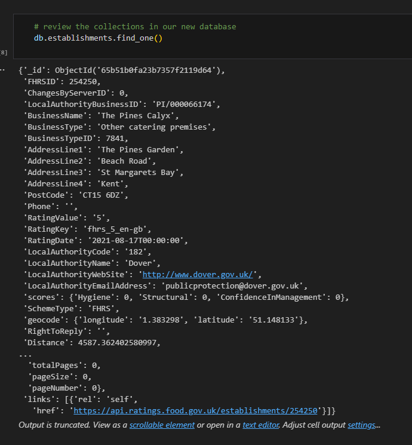
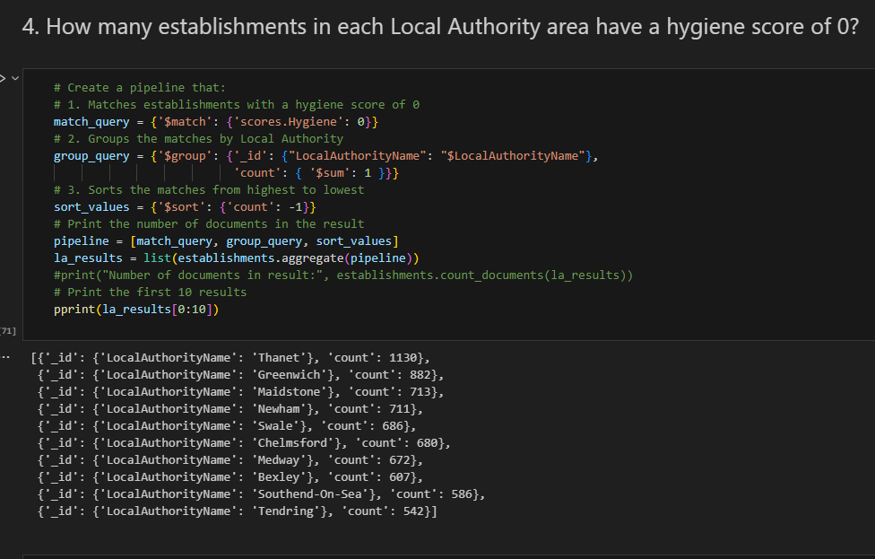

# UK Food Standards Analysis with MongoDB

# Summary

This project involves evaluating food hygiene ratings data for the UK Food Standards Agency to assist the editors of a food magazine, Eat Safe, Love. The solution requires setting up a database, updating it with new information, and performing exploratory analysis to answer specific questions about establishments' hygiene scores, ratings, and locations. PyMongo and Pretty Print (pprint) libraries are needed for database setup and updates. Exploratory analysis will involve querying MongoDB using PyMongo, as well as converting results into Pandas DataFrames for further analysis.

# Sample Code from Database Setup:

# Sample Code from Analysis:

# File Information:

-Solution files are in the main folder
-Resources folder contains establishments.json
-NoSQL_analysis_starter.ipynb contains detailed analysis
-NoSQL_setup_starter.ipynb contains database setup and analysis
